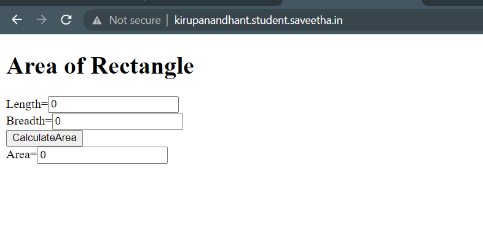

# Design a Website for Server Side Processing

## AIM:
To design a website to perform mathematical calculations in server side.

## DESIGN STEPS:

### Step 1:

To start the server and open theia IDE.

### Step 2:

Create a folder and Start the django project in that folder.

### Step 3:

Use views.py to execute the coding in serverside.

### Step 4:

Mention the path of the website in urls.py.

### Step 5:

Write a HTML and CSS code for mathematical calculator.

### Step 6:

Publish the website in the given URL.

## PROGRAM :
### urls.py
```
"""calculations URL Configuration

The `urlpatterns` list routes URLs to views. For more information please see:
    https://docs.djangoproject.com/en/3.1/topics/http/urls/
Examples:
Function views
    1. Add an import:  from my_app import views
    2. Add a URL to urlpatterns:  path('', views.home, name='home')
Class-based views
    1. Add an import:  from other_app.views import Home
    2. Add a URL to urlpatterns:  path('', Home.as_view(), name='home')
Including another URLconf
    1. Import the include() function: from django.urls import include, path
    2. Add a URL to urlpatterns:  path('blog/', include('blog.urls'))
"""
from django.contrib import admin
from django.urls import path
from mathapp import views

urlpatterns = [
    path('admin/', admin.site.urls),
    path('areaofrectangle/',views.areacalculation,name="areaofrectangle"),
    path('',views.areacalculation,name="areaofrectangle")
]
```
### views.py
```
from django.shortcuts import render

# Create your views here.
def areacalculation(request):
    context = {}
    context["area"] = "0"
    context["l"] = "0"
    context["b"] = "0"
    if request.method == "POST":
        l = request.POST.get('length','0')
        b = request.POST.get('breadth','0')
        area = int(l) * int(b)
        context["area"] = area
        context["l"] = l
        context["b"] = b

    return render(request,'mathapp/area.html',context)
```
### area.html
```
<!DOCTYPE html>
<html>
<head>
    <meta charset='utf-8'>
    <meta http-equiv='X-UA-Compatible' content='IE=edge'>
    <title>Area of Rectangle</title>
    <meta name='viewport' content='width=device-width, initial-scale=1'>
    <link rel='stylesheet' type='text/css' media='screen' href='main.css'>
    <script src='main.js'></script>
</head>
<body>
    <h1>Area of Rectangle</h1>
    <form method="post">
        
        Length=<input type="text" name="length" value="{{l}}"></input><br/>
        Breadth=<input type="text" name="breadth"value="{{b}}"></input><br/>
        <input type="submit" value="CalculateArea"></input><br/>
        Area=<input type="text" name="area" value="{{area}}"></input><br/>
    </form>
</body>
</html>
```
## OUTPUT:
### Home Page:



## Result:

Thus a website to perform mathematical calculations in server side is created.